Exercice 1: 

b : 

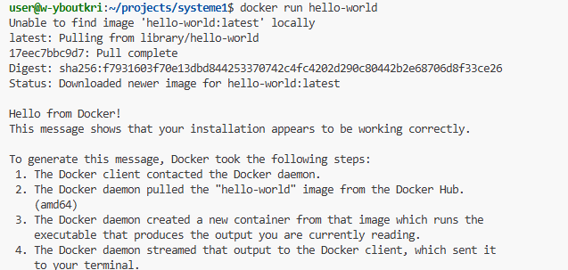

c : 

Cette commande affiche la liste de tous les conteneurs créés, y compris ceux qui sont arrêtés. Elle permet de consulter leur historique, leur état, l’image associée et leur nom.

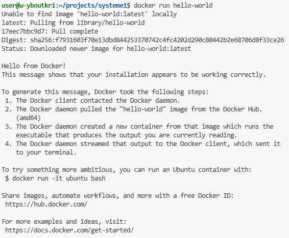

Exercice 2:

a : 
Une image Docker est un modèle fixe qui définit un environnement. Un conteneur est une version active de cette image : il s’agit de l’image en exécution, avec son propre système de fichiers et ses processus.

b : 

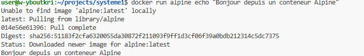

Si l’image alpine n’est pas déjà disponible en local, Docker la télécharge.
Un conteneur temporaire est ensuite créé à partir de cette image.
La commande echo "Bonjour..." s’exécute dans ce conteneur.
Une fois la commande terminée, le conteneur s’arrête immédiatement.

c : 

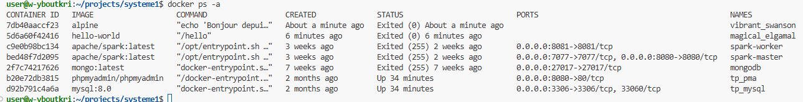

Le conteneur Alpine affiche le statut Exited car la commande echo est terminée. Un conteneur s’arrête automatiquement lorsqu’il n’a plus aucun processus à exécuter.

d : 

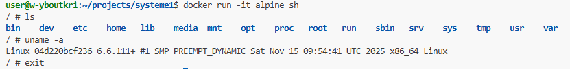

En mode interactif, on accède à un environnement Linux minimal. La commande ls affiche les répertoires système d’Alpine, uname -a confirme que le noyau Linux s’exécute dans le conteneur, et exit ferme le shell tout en arrêtant le conteneur.

Exercice 3:

a : 

J’ai modifié le fichier app.py afin de mettre en place une API FastAPI minimale, avec une route /health qui retourne le JSON {"status": "ok"}.

b : 

Le Dockerfile génère une image à partir de Python 3.11, copie l’application FastAPI, installe les dépendances nécessaires (FastAPI et Uvicorn), puis lance le serveur sur le port 8000 via l’instruction CMD.

c : 

Exercice 4:

a : 

L’option -p 8000:8000 associe le port 8000 du conteneur à celui de la machine hôte. Ainsi, l’API FastAPI exécutée dans le conteneur est accessible via http://localhost:8000.

b : 

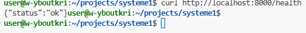

La réponse JSON est conforme au comportement prévu dans app.py.

c : 

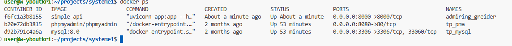

Nom : admiring_greider
Image : simple-api
Port : 8000->8000

d :

docker ps liste uniquement les conteneurs actuellement en cours d’exécution.
docker ps -a affiche l’ensemble des conteneurs, y compris ceux arrêtés (statut Exited).

Exercice 5:

c : 

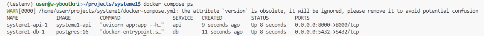

d : 

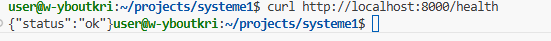

e : 

docker compose down stoppe tous les conteneurs définis dans le fichier docker-compose.yml et les supprime, tout en conservant les volumes nommés.
docker stop <id> arrête uniquement un conteneur spécifique, sans le supprimer, et n’affecte pas les autres services de la stack.

Exercice 6:

a : 

La commande docker compose exec db psql -U demo -d demo ouvre un shell PostgreSQL dans le conteneur db.
L’option -U indique l’utilisateur, -d précise la base de données, et exec exécute la commande dans un conteneur déjà en cours d’exécution.

b : 

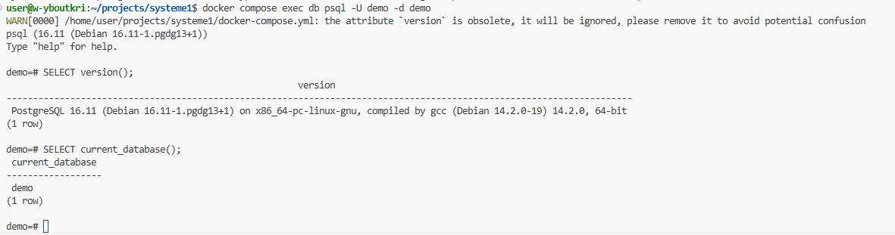

SELECT version(); retourne la version de PostgreSQL utilisée.
SELECT current_database(); indique que la base de données actuellement active est demo.

c : 

Depuis un autre conteneur de la stack, la base est accessible via :
hostname : db
port : 5432
user / password / db : demo / demo / demo

d :

docker compose down -v arrête et supprime les conteneurs, puis efface également les volumes associés aux services. Cela entraîne la suppression définitive des données persistées, comme le contenu d’une base PostgreSQL.

Exercice 7:

a : 

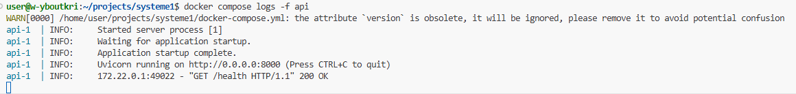

b : 

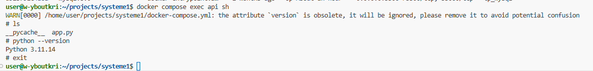

En accédant au conteneur via la commande docker compose exec api sh, j’ai pu constater la présence du fichier app.py et vérifier la version de Python en cours d’utilisation. Cette méthode est cruciale pour contrôler le contenu d’une image et identifier d’éventuels problèmes liés aux dépendances ou à l’absence de certains fichiers.

c :

Après avoir relancé le service avec docker compose restart api, l’API reste accessible sur /health.  
Redémarrer un service est pratique lorsqu’on change des variables d’environnement, que l’application rencontre un incident ponctuel ou qu’un fichier a été modifié sans nécessiter la reconstruction du conteneur.

d : 

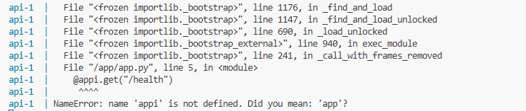

J’ai ainsi pu déterminer la cause : le nom de la variable FastAPI était erroné. Le diagnostic s’effectue toujours avec docker compose logs, car toute modification du code dans un conteneur actif reste sans effet : il est nécessaire de reconstruire l’image.

e : 

Nettoyer régulièrement l’environnement Docker est important, car les conteneurs inactifs et les images non utilisées consomment de l’espace disque, ralentissent la création des builds et rendent le débogage plus complexe.

Exercice 8:

a : 

Un notebook Jupyter n’est pas approprié pour la production, car il manque de reproductibilité (exécution non séquentielle, états invisibles) et ne garantit pas un environnement stable (versions, dépendances).  
Il ne permet pas l’automatisation, ne peut pas exposer une API et n’est pas prévu pour le suivi ou l’orchestration.  
Docker apporte une solution à ces limites en offrant un environnement isolé et reproductible.

b : 

Docker Compose offre la possibilité de démarrer plusieurs services avec une seule commande, tout en gérant automatiquement les réseaux, ports, dépendances et volumes.  
Dans le cadre du TP, il a permis de lancer simultanément l’API et PostgreSQL déjà interconnectés, ce qui facilite grandement la mise en place d’un système multi-conteneurs et assure un environnement reproductible.
