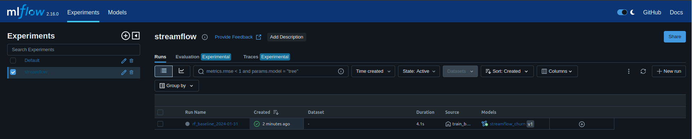
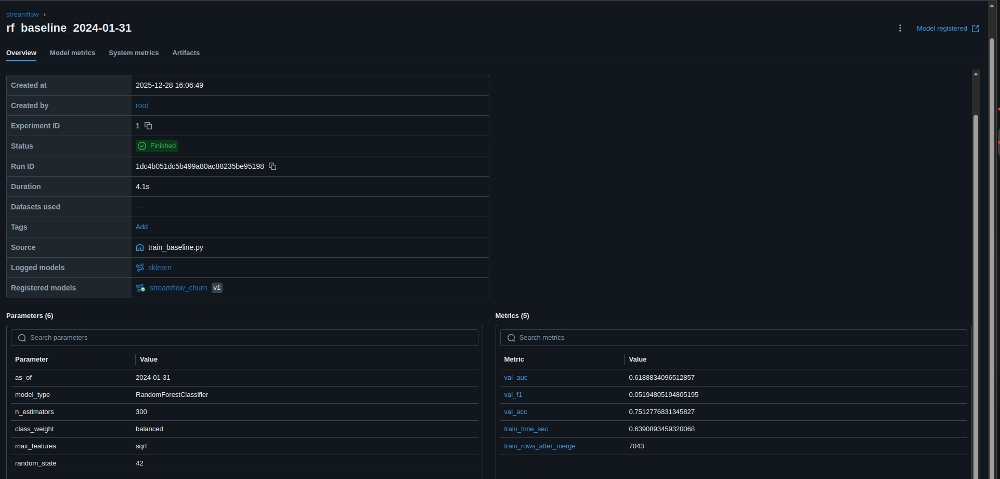
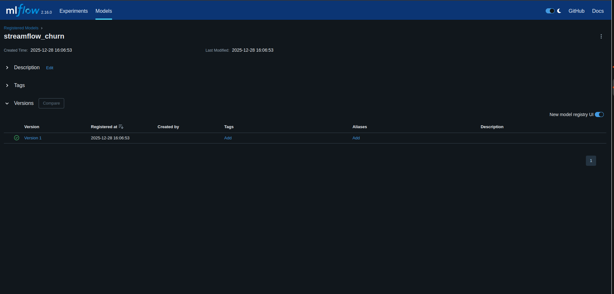
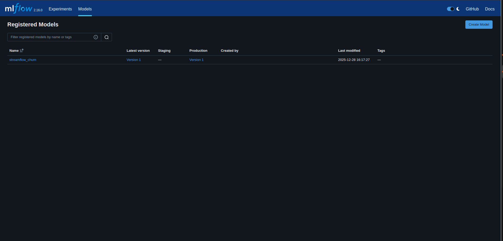
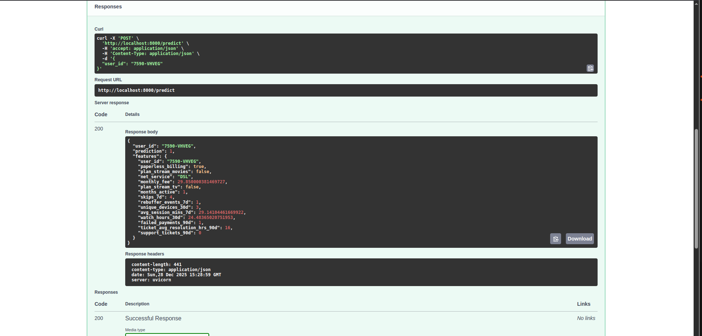
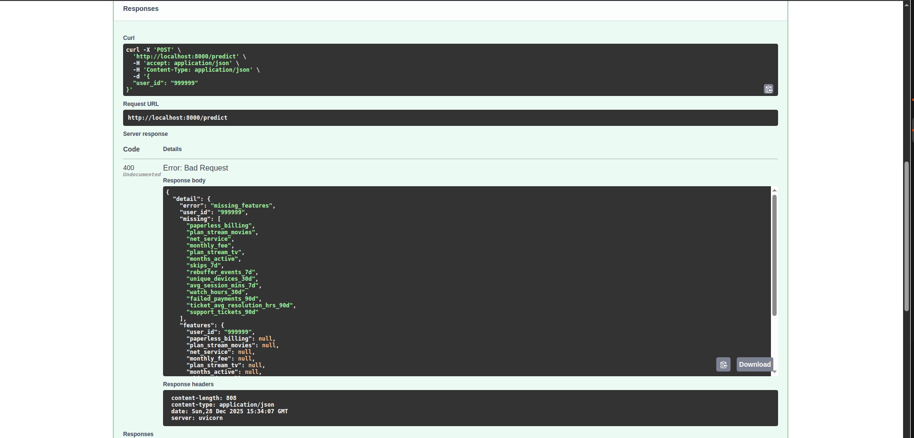

Exercice 1 :

E :

(base) younes@younes-XMG-CORE-REN-E21:~/Bureau/work/MLOPS---Projet1$ curl http://localhost:8000/features/7590-VHVEG
{"user_id":"7590-VHVEG","features":{"months_active":1,"paperless_billing":true,"monthly_fee":29.850000381469727}}

- PostgreSQL : stockage des tables et des snapshots.
- Prefect : orchestration des flux d’ingestion et de création de snapshots.
- Feast : feature store, lecture des snapshots et exposition des features matérialisées.
- MLflow : suivi des entraînements (paramètres, métriques, artefacts) et gestion du registre des modèles.
- FastAPI : fourniture des endpoints et serving en exploitant le modèle validé en Production.

Exercice 2 :

C :

- AS_OF utilisé : 2024-01-31
- Nombre de lignes du dataset après merge : train_rows_after_merge : 7043
- Colonnes catégorielles détectées (cat_cols) : ['net_service']
- Métriques (validation) + temps d’entraînement :
- AUC : 0.6189
- F1 : 0.0519
- ACC : 0.7513
- Temps d’entraînement : 4.1

D :

Définir AS_OF permet de verrouiller la période temporelle du dataset, garantissant ainsi l’utilisation des mêmes snapshots et labels à une date précise. Sans cette fixation, les données pourraient varier (nouvelles snapshots, modifications des features), rendant les métriques non comparables entre différents runs.  
Configurer random_state assure la constance des éléments aléatoires (par exemple, la séparation train/validation ou les tirages internes d’un RandomForest). Cela garantit que deux exécutions avec le même code et les mêmes données produisent des résultats similaires, permettant d’attribuer les variations observées à des modifications réelles plutôt qu’à des fluctuations aléatoires.  
Dans une approche MLOps axée sur la reproductibilité, ces deux paramètres jouent un rôle clé pour suivre, comparer et valider un modèle de manière fiable.

Exercice 3 :

A :

L’expérience MLflow dédiée à l’entraînement porte le nom de streamflow. Elle centralise tous les runs associés aux modèles développés dans le projet StreamFlow.

B :

Le run regroupe les hyperparamètres utilisés lors de l’entraînement ainsi que les métriques obtenues sur le jeu de validation (AUC, F1, Accuracy). Grâce à MLflow, toutes les données essentielles pour analyser et reproduire le run sont centralisées en un seul endroit.

C :

Le modèle `streamflow_churn` est présent dans le Model Registry. Il a été ajouté automatiquement par le script d’entraînement.

D & E :

Numéro de version : Version 1 .

G :

La gestion des stages dans MLflow (None, Staging, Production) permet de structurer clairement le cycle de vie d’un modèle, en évitant toute dépendance à des chemins locaux ou fichiers spécifiques. Cette centralisation garantit une source de vérité unique sur la version active en production, simplifiant les rollbacks, les audits et la collaboration entre les data scientists et les équipes de production. Contrairement à un déploiement manuel, cette approche minimise les erreurs humaines et assure que l’API utilise uniquement un modèle validé et promu.

Exercice 4 :

Pointer l’API vers `models:/streamflow_churn/Production` (model = mlflow.pyfunc.load_model(f"models:/{model_name}/Production")) garantit que le service utilise la version validée et promue via le Model Registry, éliminant ainsi les risques liés à l’utilisation d’un fichier local obsolète.
Le stage "Production" centralise les décisions de déploiement (promotion ou rollback) sans nécessiter de modifications dans le code de l’API. Cette approche renforce la traçabilité en permettant de relier chaque prédiction à une version spécifique du modèle et à son historique de runs.
En comparaison, l’utilisation d’un fichier `.pk` local ou d’un artefact de run impose un déploiement manuel, augmente les risques d’erreurs humaines et complique la reproductibilité.
Enfin, le Model Registry simplifie la collaboration et favorise l’automatisation des pipelines CI/CD autour du cycle de vie des modèles.

Exercice 5 :

En serving, de nombreuses pannes liées aux modèles proviennent des features. Voici deux cas fréquents :

1. **Entité absente** : Le `user_id` demandé n'existe pas dans le store en ligne de Feast. Dans ce cas, `get_online_features` renvoie des valeurs `None`, ce qui entraîne une erreur de l'API avec un message de type `missing_features`. Ce problème peut être détecté en amont en vérifiant les valeurs manquantes avant d'appeler le modèle.

2. **Store en ligne incomplet ou obsolète** : La matérialisation des données (via `feast materialize`) est soit manquante, soit non à jour (par exemple, fenêtre temporelle insuffisante ou job non relancé). Cela peut également produire des valeurs `None` ou incohérentes, entraînant des erreurs côté API.

Pour minimiser ces risques, les garde-fous suivants peuvent être mis en place :

- Refuser une prédiction si une feature requise est `None`.
- Retourner une erreur explicite et actionnable, incluant un message `missing_features` accompagné de la liste des features manquantes.
- Fournir une réponse JSON structurée pour faciliter le débogage.

Ces mesures permettent de détecter et de résoudre rapidement les problèmes liés aux features, tout en garantissant une meilleure robustesse du service.

Exercice 6 :

A :

MLflow assure une traçabilité complète des entraînements en enregistrant systématiquement les paramètres, métriques et artefacts pour chaque run. Cela permet de conserver un historique détaillé, de comparer les entraînements et de les identifier de manière unique grâce à un `run_id`.

De plus, le Model Registry de MLflow offre une gestion centralisée des modèles. Chaque modèle est versionné, lié à un run spécifique, et peut être promu à différents stages (Staging, Production). Cette approche garantit une identification claire du modèle utilisé par l’API, tout en simplifiant les processus de déploiement et de gestion des versions.

B :

Le stage "Production" permet à l’API de charger automatiquement le modèle validé dès son démarrage, sans dépendre d’un chemin de fichier ou d’un `run_id` spécifique. Cette configuration simplifie les mises à jour : il suffit de promouvoir un nouveau modèle dans MLflow pour qu’il soit utilisé, sans nécessiter de redéploiement de l’API. De plus, cette approche élimine toute ambiguïté en garantissant qu’un seul modèle est officiellement actif en production à un moment donné.

C :

Même avec MLflow, la reproductibilité peut être compromise à plusieurs niveaux :

- **Données** : L'utilisation de snapshots différents, des labels modifiés, ou une mauvaise fixation de l'AS_OF peut entraîner des variations dans le dataset d'entraînement.
- **Features** : Des modifications dans le Feature Store ou une matérialisation incorrecte peuvent altérer les valeurs utilisées à l'entraînement ou au serving.
- **Code** : Tout changement dans le pipeline de prétraitement ou dans l'API sans réentraînement peut rendre le modèle obsolète.
- **Environnement** : Des versions différentes de bibliothèques Python peuvent provoquer des divergences de comportement, même avec le même modèle.
- **Configuration** : Des variables d'environnement incorrectes ou incohérentes entre les services peuvent perturber le fonctionnement global.

Ces facteurs soulignent l'importance d'une gestion rigoureuse et d'une documentation précise pour garantir la reproductibilité.
