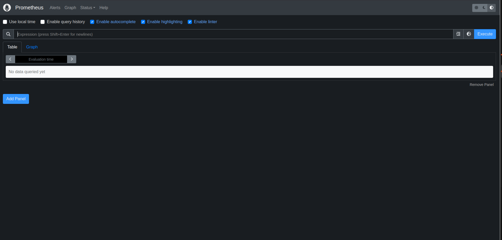
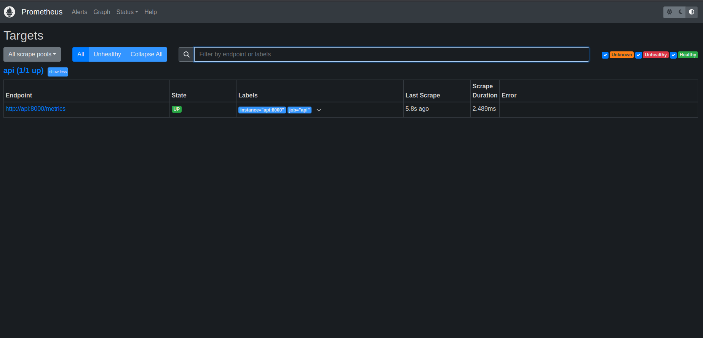
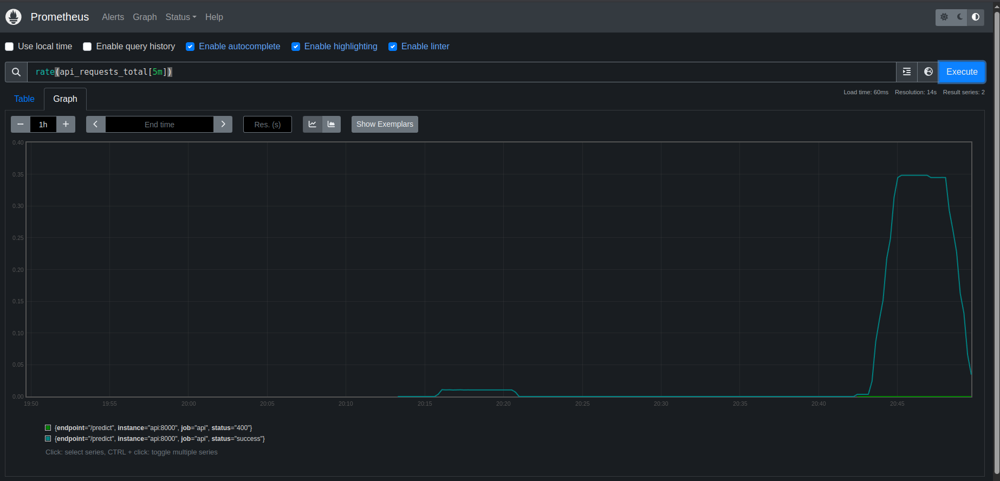
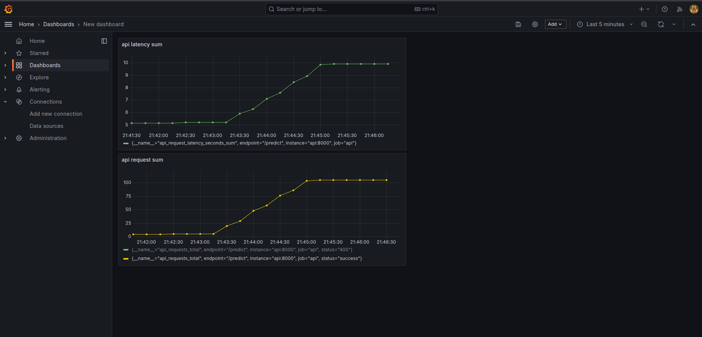
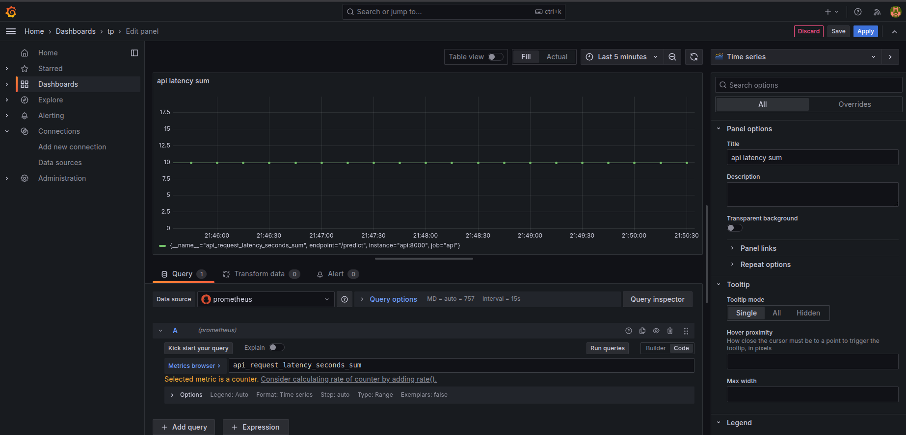
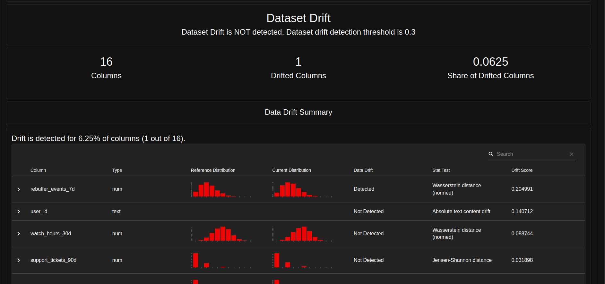

Exercice 1 :

(base) younes@younes-XMG-CORE-REN-E21:~/Bureau/work/MLOPS---Projet1$ docker compose up -d
[+] Running 24/24
✔ grafana Pulled 28.0s
✔ 4abcf2066143 Pull complete 1.1s
✔ 39aee5fd3406 Pull complete 1.1s
✔ 592f1e71407c Pull complete 1.7s
✔ 66aec874ce0c Pull complete 2.0s
✔ bde37282dfba Pull complete 2.0s
✔ b6982d0733af Pull complete 2.4s
✔ ab3c28da242b Pull complete 22.2s
✔ e4892977d944 Pull complete 25.6s
✔ ef2b3f3f597e Pull complete 25.6s
✔ 27a3c8ebdfbf Pull complete 25.6s
✔ prometheus Pulled 26.5s
✔ 9fa9226be034 Pull complete 6.2s
✔ 1617e25568b2 Pull complete 7.5s
✔ 25011dfbfdeb Pull complete 17.6s
✔ f6c7e1c85066 Pull complete 24.0s
✔ f925e29e3973 Pull complete 24.0s
✔ 67c7af41f1ac Pull complete 24.0s
✔ e2015cdcb081 Pull complete 24.0s
✔ d0079b8baf74 Pull complete 24.0s
✔ ba920d0bcda2 Pull complete 24.0s
✔ 04d7bae2d3ad Pull complete 24.0s
✔ 8b2021cd7028 Pull complete 24.1s
✔ 23133967bfe3 Pull complete 24.1s
[+] Running 8/8
✔ Volume "mlops---projet1_grafana-data" Created 0.0s
✔ Container mlops---projet1-mlflow-1 Running 0.0s
✔ Container mlops---projet1-postgres-1 Running 0.0s
✔ Container mlops---projet1-feast-1 Running 0.0s
✔ Container mlops---projet1-api-1 Running 0.0s
✔ Container streamflow-prometheus Started 0.8s
✔ Container mlops---projet1-prefect-1 Started 0.8s
✔ Container streamflow-grafana Started

Prometheus utilise `api:8000` car, dans Docker Compose, les conteneurs communiquent entre eux en utilisant le nom du service défini dans le réseau Docker. Utiliser `localhost` ferait référence à Prometheus lui-même, et non à l’API cible.

Exercice 2 :

curl http://localhost:8000/metrics

# HELP api_requests_total Total number of API requests

# TYPE api_requests_total counter

api_requests_total{endpoint="/predict",status="success"} 1.0

curl http://localhost:8000/metrics

# HELP api_requests_total Total number of API requests

# TYPE api_requests_total counter

api_requests_total{endpoint="/predict",status="success"} 4.0

Une moyenne de latence peut dissimuler des problèmes sous-jacents : par exemple, quelques requêtes très lentes peuvent être noyées dans un grand nombre de requêtes rapides, donnant une impression erronée de performance globale.

Un histogramme, en revanche, permet de visualiser la distribution complète des latences. Cela facilite la détection de dégradations intermittentes, de longues files d'attente ou de pics de latence. Ce type de visualisation est particulièrement utile en production pour définir des objectifs de niveau de service (SLO) et analyser les valeurs aberrantes.

Exercice 3 :

- rate(api_request_latency_seconds_sum[5m]) / rate(api_request_latency_seconds_count[5m]) : représente la latence moyenne (en secondes) des requêtes observée sur les 5 dernières minutes (somme des latences / nombre de requêtes).

Exercice 4 :

Les métriques RPS (Requêtes Par Seconde) et de latence sont essentielles pour détecter rapidement des problèmes d’infrastructure ou de charge, tels qu’une augmentation soudaine du trafic, une saturation de l’API ou un ralentissement des temps de réponse. Elles permettent d’identifier efficacement des pannes techniques, des régressions de performance ou des erreurs de dimensionnement.

Cependant, ces métriques ne fournissent aucune indication sur la qualité des prédictions du modèle, comme sa précision, ses biais ou le drift des données. Une API peut fonctionner rapidement tout en générant des prédictions incorrectes ou obsolètes.

Ainsi, ces dashboards offrent une première couche d’observabilité axée sur la performance et la stabilité du système, mais ils ne couvrent pas encore les aspects liés au comportement et à la qualité du modèle ML.

Exercice 5 :

[Evidently] report_html=/reports/evidently/drift_2024-01-31_vs_2024-02-29.html report_json=/reports/evidently/drift_2024-01-31_vs_2024-02-29.json drift_share=0.06 -> NO_ACTION drift_share=0.06 < 0.30 (target_drift=0.0)

Covariate drift : correspond à une modification de la distribution des variables d'entrée (features X) entre `month_000` et `month_001`. Bien que la cible (label) reste inchangée, les données fournies au modèle évoluent.

Target drift : désigne une variation dans la distribution de la variable cible (y), ici `churn_label`. Cela se traduit généralement par un changement dans la proportion de churn observée entre les deux périodes.
