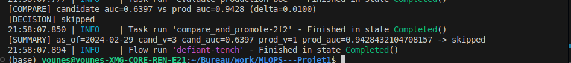
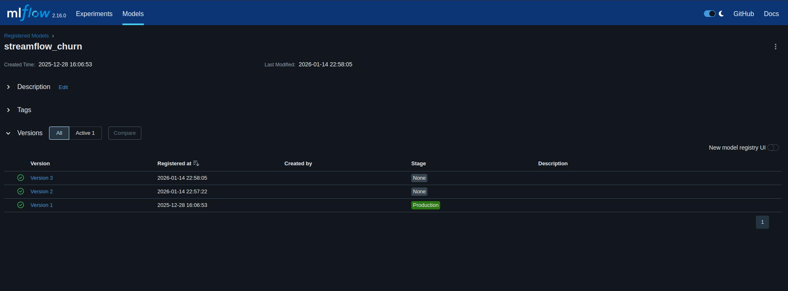
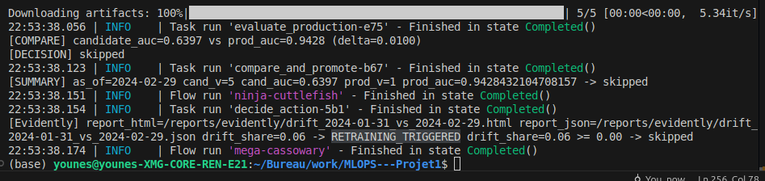
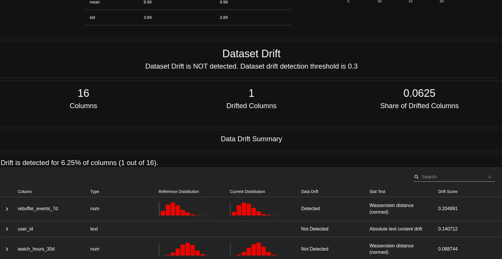
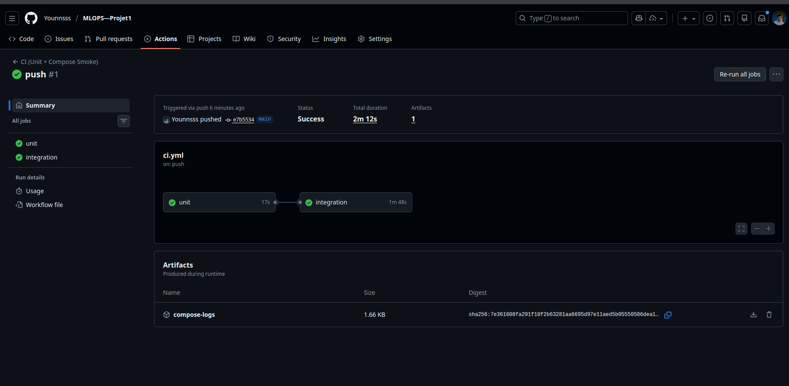

Exercice 1 :

user@w-yboutkri:~/projects/MLOPS---Projet1$ docker compose up -d
0.0s
✔ Container mlops---projet1-postgres-1 Created 0.0s
✔ Container mlops---projet1-mlflow-1 Created 0.0s
✔ Container mlops---projet1-prefect-1 Created 0.0s
✔ Container mlops---projet1-feast-1 Created 0.0s
✔ Container mlops---projet1-api-1 Created 0.0s
✔ Container streamflow-prometheus Created 0.0s
✔ Container streamflow-grafana Created 0.0s

user@w-yboutkri:~/projects/MLOPS---Projet1$ docker compose ps
NAME IMAGE COMMAND SERVICE CREATED STATUS PORTS
mlops---projet1-api-1 mlops---projet1-api "uvicorn app:app --h…" api About a minute ago Up 59 seconds 0.0.0.0:8000->8000/tcp
mlops---projet1-feast-1 mlops---projet1-feast "bash -lc 'tail -f /…" feast About a minute ago Up 59 seconds  
mlops---projet1-mlflow-1 ghcr.io/mlflow/mlflow:v2.16.0 "mlflow server --bac…" mlflow About a minute ago Up 59 seconds 0.0.0.0:5000->5000/tcp
mlops---projet1-postgres-1 postgres:16 "docker-entrypoint.s…" postgres About a minute ago Up 59 seconds 0.0.0.0:5432->5432/tcp
mlops---projet1-prefect-1 mlops---projet1-prefect "/usr/bin/tini -g --…" prefect About a minute ago Up 59 seconds  
streamflow-grafana grafana/grafana:11.2.0 "/run.sh" grafana About a minute ago Up 58 seconds 0.0.0.0:3000->3000/tcp
streamflow-prometheus prom/prometheus:v2.55.1 "/bin/prometheus --c…" prometheus About a minute ago Up 58 seconds 0.0.0.0:9090->9090/tcp

Exercice 2 :

(venv) user@w-yboutkri:~/projects/MLOPS---Projet1$ pytest -q
.. [100%]
2 passed in 0.02s

Une fonction pure est isolée (sans dépendances spécifiques comme Prefect/MLflow, et sans opérations d'entrée/sortie), permettant de tester la logique décisionnelle de manière rapide, déterministe et indépendante de toute infrastructure externe.

Exercice 3 :

On impose un delta pour éviter de promouvoir un modèle pour un gain trop faible, souvent à cause du hasard du split ou au bruit statistique.

Exercice 4 :

Exercice 5 :

younes@younes-XMG-CORE-REN-E21:~/Bureau/work/MLOPS---Projet1$ curl -s -X POST "http://localhost:8000/predict" \
 -H "Content-Type: application/json" \
 -d '{"user_id":"7590-VHVEG"}' | jq
{
"user_id": "7590-VHVEG",
"prediction": 1,
"features": {
"user_id": "7590-VHVEG",
"net_service": "DSL",
"plan_stream_movies": false,
"monthly_fee": 29.850000381469727,
"plan_stream_tv": false,
"paperless_billing": true,
"months_active": 1,
"skips_7d": 4,
"watch_hours_30d": 24.48365020751953,
"unique_devices_30d": 3,
"rebuffer_events_7d": 1,
"avg_session_mins_7d": 29.14104461669922,
"failed_payments_90d": 1,
"ticket_avg_resolution_hrs_90d": 16.0,
"support_tickets_90d": 0
}
}

l’API charge le modèle MLflow au démarrage et le garde en mémoire.
Il faut redémarrer le service pour recharger la nouvelle version Production après une promotion dans le registry.

Exercice 6 :

C'est pour valider l’intégration multi-services et vérifier que l’API démarre correctement qu'on démarre Docker Compose dans la CI.

## Synthèse – Monitoring, réentraînement et CI/CD

Dans ce projet, le suivi du drift des données s’appuie sur Evidently, qui compare une période de référence à une période courante. L’indicateur principal, `drift_share`, mesure la proportion de features présentant un drift statistiquement significatif. Un seuil de 0.02 déclenche automatiquement le réentraînement, bien qu’en production ce seuil serait souvent relevé pour éviter des réentraînements inutiles dus au bruit ou à des fluctuations normales.

Lorsque le drift dépasse ce seuil, le flow `train_and_compare_flow` est lancé. Il construit un dataset cohérent à une date donnée (`as_of`), entraîne un modèle candidat, puis évalue ses performances sur un jeu de validation via la métrique `val_auc`. Le modèle en Production est évalué sur le même split. La promotion repose sur une règle claire et testée : le modèle candidat n’est promu que si son `val_auc` dépasse celui du modèle en Production d’au moins un delta, afin d’éviter des promotions pour des gains marginaux ou aléatoires.

Les responsabilités sont bien réparties entre les outils :

- **Prefect** orchestre les workflows MLOps (monitoring, entraînement, comparaison, promotion) et gère la logique métier.
- **GitHub Actions** assure la CI : exécution rapide des tests unitaires et vérification du démarrage de la stack Docker via un healthcheck. Aucun entraînement complet n’est effectué dans ce contexte.

## Limites et axes d’amélioration

La CI ne doit pas inclure l’entraînement complet du modèle, car ce processus est coûteux, lent et non déterministe, ce qui nuirait à la stabilité et à la maintenabilité des pipelines.
Des tests complémentaires sont nécessaires, notamment des tests d’intégration sur les flows Prefect, des tests de non-régression sur les métriques, et des tests de robustesse sur les données en entrée.
Enfin, en environnement de production, une validation humaine reste souvent indispensable avant toute promotion de modèle : gouvernance ML, conformité réglementaire, validation métier et analyse d’impact sont essentielles pour sécuriser les déploiements.
